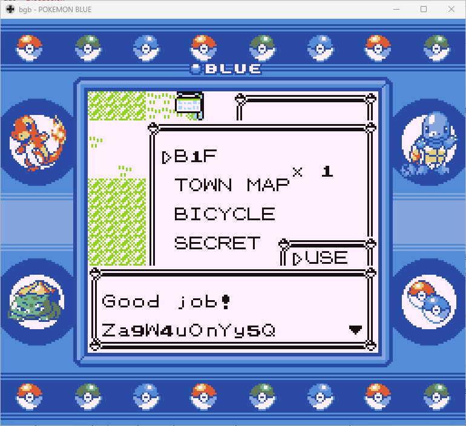
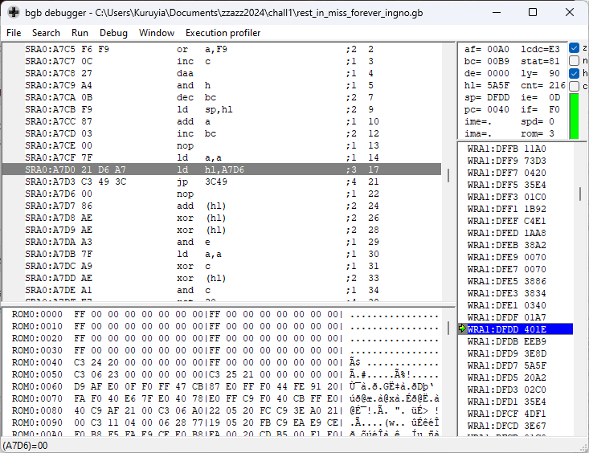

# Hacking Challenge I - Hall of Fame Data Recovery (Red/Blue)

> B1F is a truly amazing item. I used it to keep a small ACE payload which reminded me of my super secret password. But I encountered Missingno. in battle, and my payload got destroyed!  
> Think it's still possible to recover it? Here's [the save file I got after the incident](https://github.com/zzazzdzz/fools2024/blob/main/hack_challs/files/rest_in_miss_forever_ingno.sav).

Let's start with the first challenge of the list (although this was not the one I started with, but whatever!): in this one, we're given a save file for Pokémon Red/Blue, and we need to recover the password from it.

Taking a look at the description of the challenge, we immediately get two important information:
- The password is given by the payload that gets executed by the "B1F" item
- That payload got destroyed by a dreaded encounter with Missingo :c

So, it looks like our mission here will be to try to recover the payload. But first, let's introduce some concepts of this challenge.

## What the heck is a Hall of Fame??

The Hall of Fame is a log in the game that records whenever you beat the game by finishing the Pokémon League. Each entry of this log, corresponding to each time you beat the game, contains the team of Pokémon that you used to beat the Pokémon League.

In generation 1, this log can contain 50 entries maximum, for a grand total of 300 Pokémon.

Hall of Fame data is stored [in the first bank of the SRAM](https://github.com/pret/pokered/blob/fabe2b3fb3fb5a849c5220298acabbdc9ad30f3b/ram/sram.asm#L9C1-L9C12) (external RAM on the cartridge, that is also used by the game as a way to save the game because it is kept powered with a battery), mapped [at address `A598h`](https://github.com/pret/pokered/blob/b5bf00e104f0254958349d69952e368832de670e/pokered.sym#L17468) (that I'll now write `SRA0:A598h` for clarity about which SRAM bank we're talking about) for both Pokémon Red and Blue.

## What the heck is a "B1F"??

B1F is a special glitch item that cannot be obtained normally, which has the very useful property of allowing Arbitrary Code Execution (ACE) because, when used, it starts executing code at `A7D0h`.

It is even more interesting because that address actually is located right in the Hall of Fame data, and we kinda control what gets written over there by carefully selecting the Pokémon with which we're beating the Pokémon League.

## What the heck is a Missingno??

Missingno is the name of a very famous glitch Pokémon present in Red and Blue, which usually shows up when the game tries to load the data of an invalid Pokémon.

One interesting effect of encountering this Pokémon is that it corrupts the data present in the Hall of Fame.

To understand why, we need to take a look at how sprites are handled within those games. Pokémon sprites in Red and Blue are stored compressed in the game ROM, and whenever the game needs to display one of them, it runs a decompression routine that will place the decompressed sprite in some sprite buffers mapped at [`SRA0:A000h`](https://github.com/pret/pokered/blob/b5bf00e104f0254958349d69952e368832de670e/pokered.sym#L17465), [`SRA0:A188h`](https://github.com/pret/pokered/blob/b5bf00e104f0254958349d69952e368832de670e/pokered.sym#L17466) and [`SRA0:A310h`](https://github.com/pret/pokered/blob/b5bf00e104f0254958349d69952e368832de670e/pokered.sym#L17467).

If those addresses sound familiar, it's because they are located right before the contents of the Hall of Fame we just talked about.

Going back to Missingno, because this is a glitch Pokémon that is not supposed to appear in a normal playthrough, no real sprite has been planned for it, and as such, when the game decompresses the "sprite" of Missingno, it ends up putting garbage values in the sprite buffers. Not only that, but it ends up overflowing those sprite buffers and starts writing garbage past them, directly in the Hall of Fame data structure, which is why there is an observable corruption of it.

## Understanding the bigger picture

Now, we have a greater understanding of how this password payload has been set up: we expect some valid instructions to be present at `SRA0:A7D0h`, which will get executed by B1F (making sure beforehand to load SRAM bank 0) and hopefully display the password.

We also know that, because the player has seen Missingo, this payload probably got overwritten with garbage data because of sprite decompression.

Now that the stage is set, I actually have to reveal the truth: during my research on the topic, I stumbled upon [a video from TheZZAZZGlitch](https://www.youtube.com/watch?v=_-wVsN8rVks) that thoroughly explained the effects of B1F, as well as how it can be combined with the effects of glitch Pokémon such as `C6h` and `DCh` (this is their internal IDs) to create predictable behavior.

This video was pretty much a speed-run exploit for this challenge, as this is basically the entire premise for this challenge. In this video, TheZZAZZGlitch shows us how they analyzed the behavior of the decompression routine using a Lua script for [VBA-Rerecording](https://github.com/TASEmulators/vba-rerecording) (yes yes, I know...), and then extracted the results of this analysis to be used by a C++ program that simulates SRAM corruption. The best thing in all of that? Both the script and the program were made [available to download](https://drive.google.com/drive/u/0/folders/1oZ0EpIWIA0y4QVd9guxaI8caO_k-ReVW).

Fast-forwarding into this video, at [6:39](https://youtu.be/_-wVsN8rVks?si=on9kJ0T7vCixswQT&t=399), we also learn that the seemingly random SRAM corruption that happens is cycling, which means that if we run the corruption simulator enough times, we'll start seeing values that we already saw on previous iterations.

This immediately gave me the solution for solving this challenge: if the SRAM has been corrupted once in the save file that we were given, and if this corruption is cycling, then surely we can recover the payload by determining the cycle length at `SRA0:A7D0h`, and then stop the simulator right before we get to that point!

## Running the Lua script

So I quickly downloaded VBA-Rerecording along with the SRAM corruption simulator to try to reproduce what I saw in the video. The simulator came with behavior files for Pokémon `C6h` and `DCh`, so I tried to run the script, replace the first Pokémon in the party with `C6h`, looked at its sprite and... success! We get the same behavior file as the one that is included, which means that we have a reproducible environment.

The second step was to do the same thing but now, for Missingno. It has a lot of different IDs, but I went with the non-original one `1Fh`. Doing the same thing, replacing the first Pokémon in the party with this Missingno led to absolutely... nothing! I still don't know why, but when it is seen from the party menu, Missingno's sprite doesn't want to appear (maybe it is being shy?). I know for a fact that I have a Missingno in front of me, because it has its infamous double-type Bird/Normal.

This was not really a road-blocker, because if it didn't want to appear in my party, then we're just going to make it appear in the wild! So this is exactly what I did, overwriting addresses starting from `WRA1:D888h` (bank 1 of the Work RAM - this is where [wild Pokémon encounters are stored](https://datacrystal.romhacking.net/wiki/Pok%C3%A9mon_Red_and_Blue/RAM_map#Wild_Pok%C3%A9mon)) with value `1Fh`, we go in the tall grass and...

...success!? I mean, we are in front of Missingno in all its glitchy glory, but the Lua script just threw up a ton of error messages.

Looking at the error messages, we can see that the "unsafe SRAM writes" are always happening when the `PC` register (the register that contains the address of the next instruction to execute) is always either at:
- `7EA5h`, with an opcode of `77h` (which disassembles to the instruction `LD [HL], A`), or
- `7EA6h`, with an opcode of `09h` (which disassembles to the instruction `ADD HL, BC`)

We can see that the second line doesn't make much sense, as a `ADD HL, BC` instruction should not write to memory. And indeed it doesn't, we just need to decrease by one those addresses (the log lines were just being a bit misleading):
- `7EA4h`, with an opcode of `32h` (which disassembles to the instruction `LD [HL-], A`) - writes the content of register `A` at the address pointed by register `HL`, _then_ decreases the `HL` register
- `7EA5h`, with an opcode of `77h` (which disassembles to the instruction `LD [HL], A`) - writes the content of register `A` at the address pointed by register `HL`

This is much more in line with what we see!

The fix to apply to the Lua script was pretty quick, as the "write the content of register `A` somewhere in memory" operation was already handled by the script, so I just needed to patch in the two new addresses that those operations could come from. The patched script [is available here](./tools/chall1_sram/sprite_behavior.lua)!

In the end, re-running the script with the fix gave me a nice [173,406 bytes text file](./tools/chall1_sram/behavior.txt) that was ready for analysis.

## Running the C++ simulator

Once I had my behavior file in hand, I could go to the next step which was to simulate SRAM corruptions using the C++ simulator.

I modified the [sequences.cpp](./tools/chall1_sram/sequences.cpp) file that was pretty much doing what I wanted it to do: given a behavior file and a dump of an initial SRAM, it runs the SRAM corruption simulation on it and spit out some results.
So this is pretty much what I did, I gave it my fresh behavior file from `1Fh` Missingno, and as the initial SRAM dump, I just gave it the save file for this challenge (which is basically a raw dump of all the SRAM banks).

Then, I ran the solution 100 times, printing what would be the beginning of the memory at `SRA0:A7D0h` at each iteration, and then Ctrl+F in my terminal to look for the bytes of the initial state. 

And it worked! I actually found that the same bytes were found on the 64th iteration. Not only that, but looking at the 65th iteration, we could see that they were the same bytes as the 1st one, and so on and so forth...

So, I just took the bytes that would be from address `SRA0:A7D0h` to `SRA0:A800h` (because it looked like the entire block of the payload), patched them into the save file, started the game, checked a Pokémon in my party (to load the correct SRAM bank), used B1F, and...

We have a password, challenge 1 done!

Actually, if we now take a look at the disassembly of the payload:

We see that the code simply loads the `HL` register with the address of the text to display, and then jumps to the `PrintText` routine (located at [`3C49h`](https://github.com/pret/pokered/blob/b5bf00e104f0254958349d69952e368832de670e/pokered_vc.sym#L1021)).
