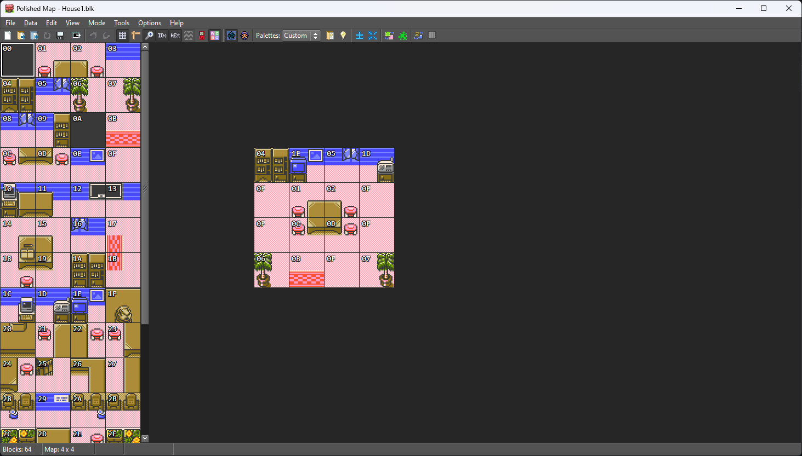
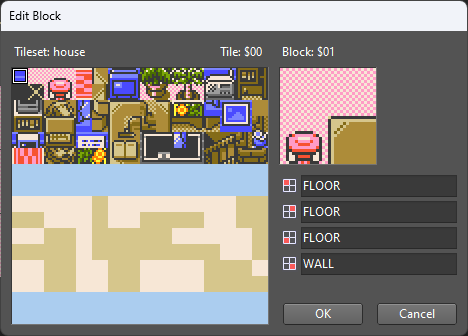
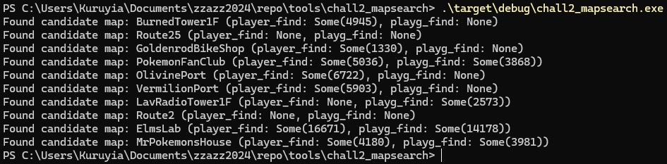
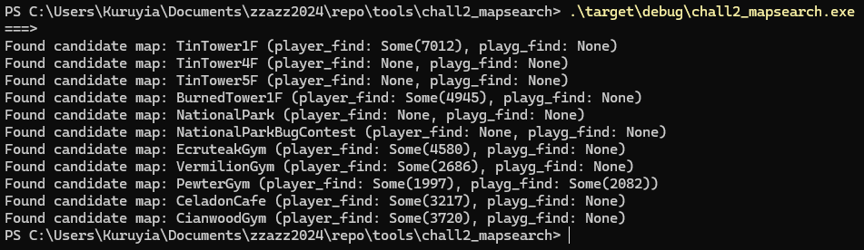
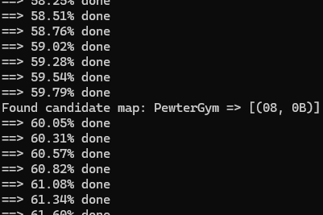
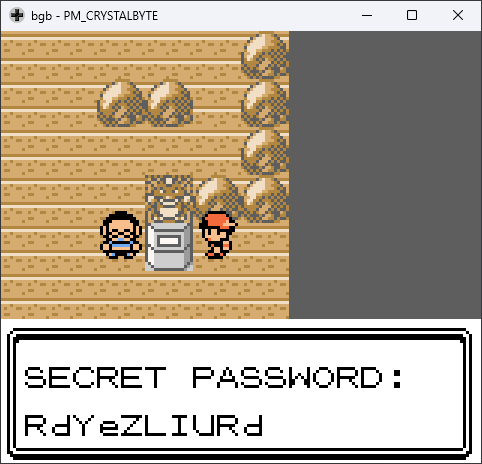

# Hacking Challenge II - The Sus-file (Crystal)

_"I got this Pokémon Crystal save file from a friend, but it's really strange. Sometimes weird colored artifacts appear on the screen, and sometimes the game just straight up crashes. I'm sure there's something hidden in it. Maybe you'll be able to figure it out? [Here's the save file I got](https://fools2024.online/assets/suspicious.sav)."_

Let's go for challenge 2! This is actually the challenge that took me the most amount of time writing a tool for, but in the end, having the tool spit out the correct solution was very satisfying because you actually see it do all the work that you could have done by hand, only a lot faster than you can dream of.

In this challenge, we get a save file for Pokémon Crystal (a Game Boy Color-exclusive game, and the last Pokémon one for this console and for generation 2)... and that's seemingly all. The description of this challenge (seen above) only gives us a hint that sometimes, the player sees graphical artifact on their screen, and that sometimes the game even crashes.

Not gonna lie, searching for the entry point of this challenge took me quite a bit of time, as I was just trying random stuff in the game and walking around the map hoping that the glitches or even a crash would trigger by themselves, leading me to some clue about what to do to trigger the payload. In reality, nothing happened during that time and the game looked very normal to me, which led me to believe that maybe my version of the game was not the correct one (there are 3 main versions, the original one, the version 1.1 one and the Australian one, without counting the debug variants and the version 1.1 for Virtual Console).

The save file itself looks fine once loaded: you start at Goldenrod City, but the game has been completed with all 16 badges and an entire team of level 100 Pokémon (and also an entire living Pokédex and 99x master balls... that's some serious dedication, keep up the grind!).

Fast-forwarding the search phase a bit, at some point I decided to look inside the PC in the Pokémon Center, but just after interacting with it, I noticed something peculiar: right after having printed the name of the player, the game was taking a noticeable amount of time before continuing with the rest of the sentence.

This raised some suspicions (although very light ones), so I decided to investigate further into this name by opening the memory viewer of the emulator.

## Analyzing the player's (and other peoples) name

The first very important thing to note is that Pokémon Crystal does not use the standard ASCII character encoding that we are all used to. Instead, they have their own character encoding (which maps pretty well to their corresponding tile index in VRAM), whose definition in the code you can find [here](https://github.com/pret/pokecrystal/blob/e8079e6d4849961dc1706b5b9b9f2c9cd693f509/constants/charmap.asm) in the pret project, and in more details [on Bulbapedia](https://bulbapedia.bulbagarden.net/wiki/Character_encoding_(Generation_II)) too.

It is important to note that, like in the ASCII character encoding, not all characters can be printed on the screen. Instead, there are some special "control" characters that have a special meaning and are interpreted by the code that displays text to perform an action, such as going to the next line or printing the player's name.

One control character that is very interesting to us is character `50h`, which acts as a string terminator. It is the equivalent of the `NULL` byte in C-style strings.

### The player's name

With that out of the way, we can begin our investigation of the player name: we first need to locate it, so taking a quick look at pret, we can determine [how the game prints the player name](https://github.com/pret/pokecrystal/blob/e8079e6d4849961dc1706b5b9b9f2c9cd693f509/home/text.asm#L305), and more specifically what label is referenced (here, it is appropriately named `wPlayerName`), to deduce [the address of the player name from the symbol map](https://github.com/pret/pokecrystal/blob/e8079e6d4849961dc1706b5b9b9f2c9cd693f509/home/text.asm#L305).

Here, we discover that the name of the player is stored from `WRA1:D47Dh` to `WRA1:D487h` (`WRA1` meaning bank 1 of the Work RAM), right before the name of some other people. Let's dump those 11 bytes of player name from the memory viewer while the game is running:

```
Hex View  00 01 02 03 04 05 06 07  08 09 0A 0B 0C 0D 0E 0F
 
00000000  8C 84 93 53 53 53 53 53  53 38 38                 MET........
```

We can see the string "MET" appear (I've fixed text decoding here) in this dump, which is the name that we can see on the start menu, so far so good. However, starting from the 4th byte, it was beginning to get odd: on the start menu, we only see "MET" as the name of the player, and it ends here, so why is there no string terminator here or anywhere in this dump?

At that point, all alarms were setting off. We're finally on the right track! There's something very fishy going on here, so let's try to discover what it is...

Because there are no string terminators here, a more accurate dump for now would be this one, that spans from `WRA1:D47Dh` to `WRA1:D49Ch`:

```
Hex View  00 01 02 03 04 05 06 07  08 09 0A 0B 0C 0D 0E 0F
 
00000000  8C 84 93 53 53 53 53 53  53 38 38 38 15 00 11 A3  MET...........Rd
00000010  12 42 4B C3 F6 DE 4E 4E  4E 4E 4E 4E 4E 4E 50     S).ä0 .........
```

So, starting from the 4th byte, we can see that, instead of our expected string terminator, we instead have character `53h`. A quick look on [Bulbapedia](https://bulbapedia.bulbagarden.net/wiki/Character_encoding_(Generation_II)#Control_characters) tells us that this character is a control character that is used to print the name of the rival. This is a bit weird because, once again, we don't see anything after the "MAT" name on the start menu, so how is this rival named exactly?

A [quick look at pret](https://github.com/pret/pokecrystal/blob/e8079e6d4849961dc1706b5b9b9f2c9cd693f509/constants/charmap.asm#L25) once again, we learn that the rival name is located under the `wRivalName` label, which is at [`WRA1:D493h`](https://github.com/pret/pokecrystal/blob/c129356b77a8e68cdc2e99a2048aa52074597416/pokecrystal.sym#L55827). So let's take this one level of indirection, and start analyzing our rival's name.

### The rival's name?

Once again, let's dump the name of the rival until we have a string terminator character. This time, we're dumping from `WRA1:D493h` to `WRA1:D49Bh`:

```
Hex View  00 01 02 03 04 05 06 07  08 09 0A 0B 0C 0D 0E 0F
 
00000000  4E 4E 4E 4E 4E 4E 4E 4E  50                       .........
```

This one is going to be very quick to analyze: it's just the same `4Eh` character repeated 8 times. According to [Bulbapedia](https://bulbapedia.bulbagarden.net/wiki/Character_encoding_(Generation_II)#Control_characters), this character is once again a control character that serves as a "Double-spaced line break", which basically means that it's returning to the beginning of the line and jumping two lines (so basically a `\r\n\n`).

Because this control character is repeated 8 times, we can conclude that printing the rival's name makes the text printer jump 16 lines.

Even more interesting is that, if we go back to the context of the player's name, we can see that the rival's name is printed 6 times in total, which means that printing the player's name makes the text jump 96 lines in total.

Looking at a regular text box in-game, we immediately see that there's a slight problem... there's clearly not the place to put 96 lines of text on the screen, so why the heck are we jumping so many of them?

Anyway, something that we'll have to solve later. For now, we can focus back on the player's name and check the next character that is after the 8 `53h` control characters. And this time, we're greeted by 3 consecutive `38h` characters.

So again, a quick look on [Bulbapedia](https://bulbapedia.bulbagarden.net/wiki/Character_encoding_(Generation_II)#Control_characters) tells us that this character is a control character that is used to print the name of Red.

### Red's name??

Okay so Red's name is Red right? We can move on!

...

Yeah not exactly - [looking at pret](https://github.com/pret/pokecrystal/blob/e8079e6d4849961dc1706b5b9b9f2c9cd693f509/constants/charmap.asm#L13), we see that Red's name is located under the `wRedsName` label, which is once again located near everything else, at address [`WRA1:D49Eh`](https://github.com/pret/pokecrystal/blob/c129356b77a8e68cdc2e99a2048aa52074597416/pokecrystal.sym#L55828).

[Bulbapedia](https://bulbapedia.bulbagarden.net/wiki/Character_encoding_(Generation_II)#Control_characters) has a very interesting description for this particular control character: "Unused. Relates to unused code for storing a custom name for Red.". So apparently, it was intended at some point to be able to change the name of Red. Sweet, didn't know that!

Let's dump the name as usual now, this time from `WRA1:D49Eh` to `WRA1:D4A7h`:

```
Hex View  00 01 02 03 04 05 06 07  08 09 0A 0B 0C 0D 0E 0F
 
00000000  D0 D0 22 D0 D0 22 D0 D0  22 50                    ..........
```

Should be pretty quick here too, there are only two different characters.

The first character we encounter is `D0h` which, [looking at pret](https://github.com/pret/pokecrystal/blob/e8079e6d4849961dc1706b5b9b9f2c9cd693f509/constants/charmap.asm#L169), is printing some text `'d`. Actually, it's a bit special, because this text is actually a single character of text with both the single quote in it, and the "d" letter.

The second (different) character we encounter is `22h`, which, from [Bulbapedia](https://bulbapedia.bulbagarden.net/wiki/Character_encoding_(Generation_II)#Control_characters), is a "Single-spaced line break" control character. So basically, this is the cousin of `4Eh` that returns to the beginning of the line but only jumps a single line (a `\r\n`).

We can see a clear pattern here: this name prints two times the `'d` character, and jumps a line. It does that 3 times in total before the end of the string.

If we now come back to the name of the player, a question comes naturally to mind: if we already jumped 96 lines, which is way out of screen, then where is it printing those `'d` characters?!

### Going back to the player's name

To answer that question, I took the dumb route and simply put watchpoints on each of the memory addresses that was part of the player's name (excluding the part that overlapped the rival's name, which gives us from `WRA1:D47Dh` to `WRA1:D492h`) to stop the execution of the game whenever those memory addresses were read.

In doing so, I had a hunch that I would find something interesting by checking the registers of the CPU each time the game stopped, and that revealed true.

Below are the dump of two interesting registers, `DE` and `HL`:

- `DE`: `D47Dh` => `D47Eh` => `D47Fh` => `D480h` => `D481h` => `D482h` => `D483h` => `D484h` => `D485h` => `D486h` => `D487h` => `D488h` => `D489h` (=> `D48Ah`)  
- `HL`: `C574h` => `C575h` => `C576h` => `C577h` => `C6B7h` => `C7F7h` => `C937h` => `CA77h` => `CBB7h` => `CCF7h` => `CD33h` => `CD6Fh` => `CDBDh` (=> `7036h`)

The `DE` register is easily recognizable and contains the address of the byte being read, which is not surprising given that we are [at the first instruction of the `PlaceNextChar` function](https://github.com/pret/pokecrystal/blob/e8079e6d4849961dc1706b5b9b9f2c9cd693f509/home/text.asm#L172).

The `HL` register is a bit more interesting, because if you've done some GBZ80 before, you know that a lot of instructions can use this register as a pointer to an address, so it's natural to expect an address to be present in this register, and what we have here very much looks like one.

Looking at the pattern of this register reveals something very interesting: on the first 4 breaks, we see that this register only increases by 1. But right after having printed the rival's name for the first time, it increases by 320, and does that for quite a few times (can you guess how many times exactly?).

So, now that we pretty much suspect that the `HL` holds the destination address of the text being printed out, let's take a shortcut and directly take the memory viewer to a trip to `CCF7h` (the address in `HL` after Red's name has been printed for the first time) while execution is stopped somewhere after having printed Red's name three times:


Very very interesting, we see two `D0h` bytes following each other, followed by 8 bytes of void. This pattern repeats itself for quite a bit actually (the last `D0h` byte can be found at address `CDDDh`).

It's almost as if there was some kind of code that was printing two `D0h` characters, and then jumping an entire line before repeating that again...

Jokes aside, we can confirm here that `HL` was indeed holding the address of where to put the characters of the text being printed. The question now is, why are we writing `D0h` bytes in this seemingly random location?

### Mobile script???

Actually, what I didn't mention until now is that when I placed all the watchpoints over the player's name, at some point, execution stopped in a very interesting place.

For each of the bytes in the name that execution stopped at, we were in the [`PlaceNextChar`](https://github.com/pret/pokecrystal/blob/e8079e6d4849961dc1706b5b9b9f2c9cd693f509/home/text.asm#L171C1-L171C14) function, which makes a lot of sense because it is part of the code that handles displaying the text on screen. However, when the watchpoint that I had placed at `WRA1:D48Ah` triggered, it was not in the context of that function, but rather in the [`_RunMobileScript`](https://github.com/pret/pokecrystal/blob/e8079e6d4849961dc1706b5b9b9f2c9cd693f509/mobile/mobile_5f.asm#L3552) function.

That function name immediately made me question, "why are we trying to run some script when we're seemingly reading the name of the player?" and "what even is a mobile script?"

To answer the first question, we can take a look back at where we stopped in the player's name:

```
Hex View  00 01 02 03 04 05 06 07  08 09 0A 0B 0C 0D 0E 0F
 
00000000  8C 84 93 53 53 53 53 53  53 38 38 38 15 00 11 A3  MET...........Rd
00000010  12 42 4B C3 F6 DE 4E 4E  4E 4E 4E 4E 4E 4E 50     S).ä0 .........
```

We already went over the `53h` and `38h` bytes, so what is that after? A `15h` byte. If we take a look [at pret](https://github.com/pret/pokecrystal/blob/e8079e6d4849961dc1706b5b9b9f2c9cd693f509/constants/charmap.asm#L7), we see a mysterious mention to `<MOBILE>`, and if take a look at [Bulbapedia](https://bulbapedia.bulbagarden.net/wiki/Character_encoding_(Generation_II)#Control_characters), we see that this character is unused but is related to the [Mobile Game Boy Adapter](https://bulbapedia.bulbagarden.net/wiki/Mobile_Game_Boy_Adapter), a Japan-exclusive peripheral for the GB/GBC/GBA that allowed to connect some compatible mobile phone to your game console.

So, now it makes a bit more sense why we ended up in this `_RunMobileScript` function, we can even see this `15h` control character [call a `RunMobileScript` function](https://github.com/pret/pokecrystal/blob/e8079e6d4849961dc1706b5b9b9f2c9cd693f509/home/text.asm#L295) at some point.

Going to the [Glitch City Wiki](https://glitchcity.wiki/wiki/Mobile_script), we see that indeed, those mobile scripts are using our `15h` control character, and that it is immediately followed by a parameter. In our case, this parameter, located at `WRA1:D48Ah` (where my watchpoint triggered), is set to `00h`.

Still on the same Wiki, we see that this parameter is a bit special because it is part of the [0x1500 control code arbitrary code execution](https://glitchcity.wiki/wiki/0x1500_control_code_arbitrary_code_execution), and running this control character sequence leads to the game starting to execute code at address `CD52h`.

Even more interesting, this `CD52h` address is right where Red's name "printed" a lot of `D0h` bytes. So, what is going to be executed there exactly? Well, taking a look at [an opcode table for the Game Boy CPU](https://gbdev.io/gb-opcodes//optables/dark), we see that instruction `D0h` is the `RET NC` instruction.

So why exactly would we want to conditionally return if the carry flag is not set? Well, we'd want that in the context of this method of arbitrary code execution because, as soon as we return, code will begin executing again right after the `1500h` sequence in the player's name!

That's correct, right in the player's name (well, actually [we're in Mom's name](https://github.com/pret/pokecrystal/blob/c129356b77a8e68cdc2e99a2048aa52074597416/pokecrystal.sym#L55826) now), after the `00h` byte and at address `WRA1:D48Bh`, we have code that is going to be executed by the Game Boy.

## Road to the payload

We're now finally going somewhere! Because `WRA1:D48Bh` is part of Mom's name, we know that code that is being executed there was in the save file, so in total control of the attacker.

So, what is present at that address? Let's disassemble it:

```asm
LD DE, $12A3
LD B, D
LD C, E
JP wBreedMon1Nickname
```

We can see that it's loading some constant into register `DE` and `BC`, and immediately jumping to the `wBreedMon1Nickname` label - so far so good, this seems to be only some sort of bootstrap code and the `wBreedMon1Nickname` label is still part of the save data (it is the nickname of one of the Pokémon left at the day-care).

Let's disassemble this label then (only the interesting stuff has been kept here, a more complete version can be found [in my notes](https://github.com/Kuruyia/zzazz2024/blob/d68b254284c8c3accd96d16b63b1cf0995463899/TODO.txt#L81-L184)):

```asm
wBreedMon1Nickname:
    ; Some validation
    LD A, ($C590)       ; (C590h) == 79h?
    CP A, $79
    JR NZ, $DF42

    LD A, ($C4AB)       ; (C4ABh) == 05h?
    CP A, $05
    JR NZ, $DF42

    LD A, ($C51F)       ; (C51Fh) == 23h?
    CP A, $23
    JR NZ, $DF42

    LD HL, $C4CB        ; (C4ABh) == 02h?
    LD A, (HL+)
    CP A, $02
    JR NZ, $DF42

    LD A, (HL+)         ; (C4ACh) == 04h?
    CP A, $04
    JR NZ, $DF42

    LD A, ($C588)       ; (C588h) == 01h?
    CP A, $01
    JR NZ, $DF42

    XOR A
    CALL wBreedMon2Exp  ; A == 35h?
    CP A, $35
    JR NZ, $DF42

    ; Real work starts here
    LD C, $0A
    LD HL, $DF7A

.loop
    LD A, C
    CALL wBreedMon2Exp

    AND A, $1F
    ADD A, $84
    ADD C
    LD (HL+), A
    DEC C
    JR NZ, .loop2
```

In this payload, we can see two separate parts: one is a verification step, and aborts the payload (jump to `DF42h`) if a condition is not fulfilled; and the other one is the actual work that will eventually lead to the password.

We also see that the `wBreedMon2Exp` "function" is called quite a lot: once in the verification step, and 10 times in the password calculation stage. This function seems to use register `A` as a parameter, and place a value as the result in that same register.

Here's what it looks like:

```asm
wBreedMon2Exp:
    ; Set up
    PUSH HL
    PUSH BC
    LD HL, wTilemap
    ADD L
    LD L, A
    LD C, $78
    XOR A

.loop
    ; Grind some numbers
    LD B, (HL)
    ADD B
    SWAP A
    INC HL
    LD B, (HL)
    XOR B
    SWAP A
    INC HL
    DEC C
    JR NZ, .loop

    ; Exit the function
    POP BC
    POP HL
    RET
```

This function seems to do some fancy operations reading from 120 bytes of memory starting from `wTilemap + A`. At that point, it seems pretty safe to bet that this function is the meat of the password generator.

It's interesting to note that this password gets calculated from the [`wTilemap`](https://github.com/pret/pokecrystal/blob/c129356b77a8e68cdc2e99a2048aa52074597416/pokecrystal.sym#L53257) memory block, which is the same block that the verification stage also uses to check some values.

In Game Boy games, [a "tile"](https://gbdev.io/pandocs/Graphics.html) is the base unit a game can use to display graphics on the screen: it is a square of 8x8 pixel, and the screen displays a grid of them.

[A tile map](https://gbdev.io/pandocs/Tile_Maps.html) is an array of tile indexes (used to get the actual pixels of that tile from the [tile data](https://gbdev.io/pandocs/Tile_Data.html)) which are the tiles that gets displayed on the screen.

Knowing that, we can understand that this password generator seems to be very dependent of what tiles are displayed on the screen, which means that it is dependent on the location of the player.

## Cracking the password

Okay, so now that we know how the password is calculated, we can start implementing stuff to try and get the correct password.

My first attempt at this was to simply try to brute force the password to see if submitting a password that was passing all the constraints on the input data would be accepted by the event website.

### Attempt 1: Brute-force

I had very little hope that this would work, but I made this attempt more as a way of understanding more the algorithm that calculates the password, and maybe realize something along the way.

[The code itself](https://github.com/Kuruyia/zzazz2024/blob/6c967fea0c3125d5b6b90a9b958714852b21e107/tools/chall2_decrypt/src/main.rs) is very simple - in an infinite loop, it:
- generates a random array of 512 bytes, that will serve as the input data to the algorithm (this is our [`wTilemap`](https://github.com/pret/pokecrystal/blob/c129356b77a8e68cdc2e99a2048aa52074597416/pokecrystal.sym#L53257))
- replaces some values in that array by the values that are checked during the validation step of the payload
- runs one iteration of the password calculation algorithm to ensure that the result is equals to `35h` (as the validation step of the payload does too)
- runs the 10 iterations of the password generation algorithm to actually generate a password
- decodes it and prints it to the standard output

This small program generates a lot of passwords that are all passing the verification step (I also verified that the generated password corresponded to the ones generated by the algorithm in-game, given the same input data) - but unfortunately, submitting any of them on the event password lead to an "Incorrect password" message.

So, as expected, the website is waiting for a specific password and not one that passes some constraints. This program was not very long to do, so it was worth a try anyway, especially given the time that it took to code the real solver.

### Attempt 2: Searching a candidate map

So, brute-forcing didn't work, that leaves us with only one choice: we have to dig deeper. Previously, I said that the constraints on the password were checked from a part of memory where tiles are stored, and the password itself is derived from those tiles.

This means that we have to find:
- the correct map
- the correct coordinates of where to stand on that map
- some way of triggering the payload there (so an object that would display a text dialog with the player's name)

Thankfully, the pret project got us covered here with [their disassembly of Pokémon Crystal](https://github.com/pret/pokecrystal/) (that I already linked to many times above), which not only contains the code of the game, but also the data about all the maps in the game. It was time to do some data mining!

But first, we need to understand how maps are defined in Pokémon Crystal:
- a map is a collection of "blocks", which are squares of 4x4 tiles (which are themselves squares of 8x8 pixels): those are the `.blk` files that can be found [in the `maps/` directory](https://github.com/pret/pokecrystal/tree/e8079e6d4849961dc1706b5b9b9f2c9cd693f509/maps), and they are imported [from the `data/maps/blocks.asm` file](https://github.com/pret/pokecrystal/blob/e8079e6d4849961dc1706b5b9b9f2c9cd693f509/data/maps/blocks.asm) (as you can see, multiple maps can use the same layout, for e.g. the Pokémon Centers)
- a map has also associated with it a script, that : those are the `.asm` files that can be found [in the `maps/` directory](https://github.com/pret/pokecrystal/tree/e8079e6d4849961dc1706b5b9b9f2c9cd693f509/maps), and they are imported [from the `data/maps/scripts.asm` file](https://github.com/pret/pokecrystal/blob/e8079e6d4849961dc1706b5b9b9f2c9cd693f509/data/maps/scripts.asm) (this time, each map as a unique script attached to it) - those scripts contains the "dynamic" part of a map, for instance the trainers, the text dialogs, the interactive objects, the items and hidden items...
- a map has some attributes defined in the [`data/maps/attributes.asm`](https://github.com/pret/pokecrystal/blob/e8079e6d4849961dc1706b5b9b9f2c9cd693f509/data/maps/attributes.asm) file: a map name, a map ID and a border block (the ID of the block to use when displaying out of bounds content, such as the black void surrounding the interior of houses); there's also the connections between maps there, but it doesn't really interest us
- a map has a width and a height, in blocks, defined in the [`constants/map_constants.asm`](https://github.com/pret/pokecrystal/blob/e8079e6d4849961dc1706b5b9b9f2c9cd693f509/constants/map_constants.asm) file
- a map has even more data attached to it, in the [`maps/maps.asm`](https://github.com/pret/pokecrystal/blob/e8079e6d4849961dc1706b5b9b9f2c9cd693f509/data/maps/maps.asm) file, but the most interesting to us is the tileset that it uses: each tileset is defined by its collisions and its metatiles, that can be found in the [`data/tilesets/`](https://github.com/pret/pokecrystal/tree/e8079e6d4849961dc1706b5b9b9f2c9cd693f509/data/tilesets) directory, and the most interesting info to us is the metatiles because they contain the tiles that are used in this tileset, where each group of 16 bytes is a block definition

This is a non-exhaustive list, but it is enough for our purposes. Here's how that looks in the [Polished Map](https://github.com/Rangi42/polished-map) map editor:



In the middle of the window, you can see how a map is divided in a grid of blocks, with each block having its ID displayed in the upper-left corner. The sidebar on the left-hand side is displaying the entire tileset for that map.

Right-clicking one of the blocks in the sidebar, we can open the list of tiles that we can use to edit a single block:



So, with that knowledge, we can finally begin to implement a solution to find the correct location for this challenge. For this second attempt, I didn't want to go too overboard right at the start, so I decided to only filter out any map that didn't contain all the tiles that are checked in the verification step of the payload.

If we remember this step, those are the following tiles that we need to have: `79h`, `05h`, `23h`, `02h`, `04h` and `01h`.

Actually, the `79h` tile is a bit special: looking at Polished Map, I saw that there was no tileset that could possibly use it because it was always this light-blue tile next to a lot of other light-blue tiles (see screenshot above), which led me to believe that those must be unavailable for use in a map.

After a bit of tinkering around in the game, I realized that tile `79h` appeared whenever a regular text box (such as a dialogue) was open on the screen: this tile is in fact the upper-left corner of the text box border. This leads us to understand that the verification step of the payload also checks for a text box to be open via this tile, which makes sense as this payload could also be triggered by opening the start menu, which also displays the player's name.

In the end, this leaves us with checking for maps that contains those 5 tiles: `05h`, `23h`, `02h`, `04h` and `01h`. I also wanted to add a constraint to further reduce the amount of candidate maps: we know that the map must be able to display the name of the player for the payload to trigger, so we can also analyze the map scripts and look for the `<PLAYER>` and `<PLAY_G>` placeholders, which gets replaced by the player's name.

This is basically what [the first try of this attempt](https://github.com/Kuruyia/zzazz2024/blob/6c967fea0c3125d5b6b90a9b958714852b21e107/tools/chall2_mapsearch/src/main.rs#L668-L688) is attempting to do:
- for every tileset (specifically, the [`.bin` files over there](https://github.com/pret/pokecrystal/tree/e8079e6d4849961dc1706b5b9b9f2c9cd693f509/data/tilesets)), it remembers at which block index each tile index is being used
- it forgets about any tile index that doesn't interest us (the 5 tiles we talked about above)
- it loads all the maps [from here](https://github.com/pret/pokecrystal/blob/e8079e6d4849961dc1706b5b9b9f2c9cd693f509/data/maps/maps.asm) and for each of them, also loads their blocks ([the `.blk` files from here](https://github.com/pret/pokecrystal/tree/e8079e6d4849961dc1706b5b9b9f2c9cd693f509/maps))
- for each map, it retains only those which are using our 5 tiles (by checking that they contain the blocks that use those tiles, using the tileset of the map)
- for each map, it retains only those which are printing the player's name

Running this program, we get the following results:



Which looks pretty good! I mean, we only have 10 maps to look through, so it will be quick right?

Well... know that I know the solution to this challenge, I also know that it is not present in that list: I spent a bit of time going around in those maps, looking for something that would trigger the payload, but most of the texts that were printing the player's name were unavailable (mostly because the event that triggered that particular bit of dialogue has already been done).

After having looked through those maps, I was a bit discouraged because I felt like I wasn't going anywhere, so I decided to have a second go with this method of searching maps, only now I would change some constraints to get more results (and hopefully, the good one).

The second try is [this part of the map searcher](https://github.com/Kuruyia/zzazz2024/blob/6c967fea0c3125d5b6b90a9b958714852b21e107/tools/chall2_mapsearch/src/main.rs#L690-L695), and as you can see, it is a lot shorter than the code of the first try. What it does is:
- for every tileset (again, the [`.bin` files over there](https://github.com/pret/pokecrystal/tree/e8079e6d4849961dc1706b5b9b9f2c9cd693f509/data/tilesets)), it checks if it's using tiles `05h`, `23h` and `01h`, and also if it's consecutively using the `02h` and `04h` tiles (remember the verification step of the payload? both tiles were next to each other in memory) - if the tileset passes those checks, then it is kept
- it loads all the maps [from here](https://github.com/pret/pokecrystal/blob/e8079e6d4849961dc1706b5b9b9f2c9cd693f509/data/maps/maps.asm), and it removes those which are not using the tilesets that we kept during the previous step
- for each remaining map, it retains only those which are printing the player's name

The real difference between the first try and this second try is that, while in the first try, we were checking if the map were using our 5 tiles, here, in this second try, we're only checking if the map uses a tileset that uses those 5 tiles.

I was hopeful that I wouldn't get a lot of candidate maps because of the condition that I put on the `02h` and `04h` consecutive tiles: I was thinking that it would help a lot reduce the amount of tilesets that were kept. Let's check the results:



Okay, so we get another set of maps to try, and there are only 11 of them, that looks promising right? Well, I was honestly getting tired of this challenge at that point: it was late, and I was still scared from the failure that was the first try. 

So, while I looked a bit around in those maps, I felt like this was going to be the same thing as the first try: just a ton of maps that I have to check manually and that didn't even have the text dialog with the player's name anymore.

In the end, I decided to stop there for the day and go take a good nap. I had already gotten a pretty good grasp of this challenge and what I had to do, so I had still some ideas left to solve it. 

Little did I know that the correct map was sitting right in front of my eyes...

### Attempt 3: Searching _the_ candidate map

Dawn of A New Day (_insert Majora's Mask sound effect here_). The previous attempt has failed, and I couldn't find the correct map from a list of candidate maps? Well, then let's just reduce the number of candidate maps to just one!

Basically, this means that I'm going to have to write another tool (more or less based on the previous one) that will do the exact same checks as the verification step of the payload and... owo [wats dis](https://github.com/Kuruyia/zzazz2024/blob/6c967fea0c3125d5b6b90a9b958714852b21e107/tools/chall2_mapsearch2/src/main.rs)?? Exactly the program that I'm talking about!

While it took me approximately 10 seconds to introduce this new tool to you, it took me a few hours to write it, and it made my smooth brain even more smoother. So please don't do a full code review on that code, it's a bit rough around the edges (especially the part that generates the tilemap, we don't talk about that part), but it gets the job done.

Let's start by a definition of what I wanted to have: I wanted to be able to give to this tool a set of player coordinates and a map, and it would return to me the resulting contents of the [`wTilemap`](https://github.com/pret/pokecrystal/blob/c129356b77a8e68cdc2e99a2048aa52074597416/pokecrystal.sym#L53257) memory block.

Having this `wTilemap` as a result, I could then verify its content the exact same way as the verification step of the payload, which would tell me if these coordinates on this map was the correct solution.

Obviously, I wasn't going to input all the map and their possible player coordinates by end, so all that verification code would be wrapped in some fancy loops that would call it for each player coordinate on each map.

While I'm not going to complete description of my code (go check it out if you're that courageous!), here's a high level overview of what it's doing:
- it loads all the tilesets (one last time, the [`.bin` files over there](https://github.com/pret/pokecrystal/tree/e8079e6d4849961dc1706b5b9b9f2c9cd693f509/data/tilesets)) and all the maps [from here](https://github.com/pret/pokecrystal/blob/e8079e6d4849961dc1706b5b9b9f2c9cd693f509/data/maps/maps.asm)
- for each map, it loads its blocks ([the `.blk` files from here](https://github.com/pret/pokecrystal/tree/e8079e6d4849961dc1706b5b9b9f2c9cd693f509/maps)), its [attributes](https://github.com/pret/pokecrystal/blob/e8079e6d4849961dc1706b5b9b9f2c9cd693f509/data/maps/attributes.asm) (to get the ID of the map and its border block) and its [map constants](https://github.com/pret/pokecrystal/blob/e8079e6d4849961dc1706b5b9b9f2c9cd693f509/constants/map_constants.asm) (to get the width and the height of the map)
- for each map, it builds its tilemap using its tileset and its blocks
- finally, for each map and each possible player coordinate, it generates the tilemap that the player would have displayed on their screen, and then checks for our 5 tiles

At some point, I also realized that this code was not at all handling the map connections (those seamless transitions between a city and a route for instance), so I was hoping for the correct solution to be either in the middle of a map or inside a building.

It also took some trial and error to have the tool in a state where I was feeling confident that it was working and would find a solution. Thankfully, I could compare whenever I wanted the results of my tool with the contents of the memory at `wTilemap`, which helped me debug some stuff (mostly the tilemap generation code).

So, now is the time to start the tool for real. This tool was a bit slow, and it takes a dozen of seconds for it to complete its analysis, so this first attempt at running it felt like an eternity. Fingers crossed...



We have a winner let's gooooo! I honestly had shivers when I saw that: not only is this a candidate map, this was the _only_ candidate map that the tool gave me. I was still not entirely confident in the tool, so seeing a single result was very comforting, but there was one thing left to do: check out those coordinates.

So, I quickly flew from Goldenrod City to Silver Cave, crossed the border to Kanto through Route 28, then flew to Pewter City and entered the Gym. Opened the memory viewer of the emulator, positioned the player right at the coordinates that the tool gave me, and interacted with the only object I could.



We have a password! I think my heart stopped beating when I saw that text dialog. This challenge was so time-consuming, but once it ended, that felt very relaxing.