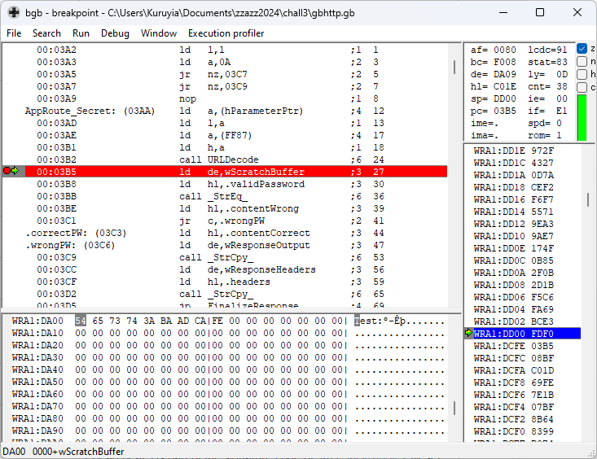

# Hacking Challenge III - gbhttp

> The GBZ80 architecture is truly amazing - so amazing that we've created a Game Boy HTTP server! It's (no longer) running at [http://fools2024.online:26273/](http://fools2024.online:26273/). However, we haven't done a proper security audit of our code yet. Think you can steal the secret password from our test server? The [source code](https://github.com/zzazzdzz/fools2024/blob/main/hack_challs/files/gbhttp.asm) is available for you to review.

This challenge is interesting because it is the only one in the list that is not tied to a specific Pokémon game, so it doesn't require any knowledge about Pokémon glitchology. Rather, we are given [the source code](https://github.com/Kuruyia/zzazz2024/blob/60bb7dae092dba08172a52678ce2638830f0ab9c/challenges/gbhttp.asm) of an HTTP server that runs on the Game Boy, and we need to find a way to exploit it and extract a password.  
The code was already neatly documented through comments, so reading it was more pleasant than just reading raw assembly (some comments in the linked file are mine).

This is actually the first challenge that I attempted, because I saw that a lot of people on the leaderboard actually got it as their first security challenge. However, I couldn't for the life of me figure out what the entry point for exploiting this server was.  
While I had pretty much the entire exploit figured out by analyzing the control flow of the program, I was still missing that piece of the puzzle that would allow me to begin the challenge, which was very frustrating.

I did a few attempts that ultimately led nowhere: I wrote [an entire emulator](https://github.com/Kuruyia/zzazz2024/tree/60bb7dae092dba08172a52678ce2638830f0ab9c/tools/chall3_emu) for the Game Boy CPU in Rust (well, GitHub Copilot wrote a lot of the code for decoding instructions for me, and not all instructions are handled, but it was enough for this HTTP server to run) so I could run a fuzzer on the input request and hopefully trigger some unexpected behavior via brute-force. I also tried to find a problem in the implementation of [the function that checks if two strings are equal](https://github.com/Kuruyia/zzazz2024/blob/60bb7dae092dba08172a52678ce2638830f0ab9c/challenges/streq.asm).

While this didn't give me the solution, it was still nice to implement the small emulator as it allowed to play a bit with [fuzzing with Rust and AFL](https://rust-fuzz.github.io/book/afl.html), and was a good refresher on the instruction set of the Game Boy CPU.

At some point, I decided to take a step back and think about the parts of the code that I didn't spend enough time on, which finally led me to discover the starting point. Here's how it went:

## Analyzing the control and data flows

### The entry point

Let's start with the beginning! The entry point of the server is the label [`EntryPoint`](https://github.com/Kuruyia/zzazz2024/blob/60bb7dae092dba08172a52678ce2638830f0ab9c/challenges/gbhttp.asm#L71).

The server starts by clearing the HRAM (High RAM, an area in memory [that spans from `FF80h` to `FFFEh`](https://gbdev.io/pandocs/Memory_Map.html)), which it uses to store [some data](https://github.com/Kuruyia/zzazz2024/blob/60bb7dae092dba08172a52678ce2638830f0ab9c/challenges/gbhttp.asm#L31-L60), and also the WRAM (Work RAM, the area of memory that games can use for general purposes). It also sets up [the stack](https://github.com/Kuruyia/zzazz2024/blob/60bb7dae092dba08172a52678ce2638830f0ab9c/challenges/gbhttp.asm#L25-L29). Then, it's waiting for something called the "harness".

The harness seems to be in fact the program that controls the HTTP server, copying the HTTP request into the memory of the emulator ([the `wRequestData` label](https://github.com/Kuruyia/zzazz2024/blob/60bb7dae092dba08172a52678ce2638830f0ab9c/challenges/gbhttp.asm#L7-L8)) and reading the response back from the emulator ([the `wResponseData` data](https://github.com/Kuruyia/zzazz2024/blob/60bb7dae092dba08172a52678ce2638830f0ab9c/challenges/gbhttp.asm#L9-L10)). This can be thought of as the bridge between the HTTP server running in the Game Boy emulator and the Internet.

A byte in memory, at [`hDriverStatus`](https://github.com/Kuruyia/zzazz2024/blob/60bb7dae092dba08172a52678ce2638830f0ab9c/challenges/gbhttp.asm#L32), is used by both the server and the harness to communicate to each other the current status of the server (the different statuses [are defined here](https://github.com/Kuruyia/zzazz2024/blob/60bb7dae092dba08172a52678ce2638830f0ab9c/challenges/gbhttp.asm#L1-L4)), so the harness knows when to copy the request into memory and get back the response, and the server knows when the harness has copied the request.

### Checking the size of the request lines

Once the harness has copied the request into memory and notified the server by writing [`STATUS_RECEIVED_REQ`](https://github.com/Kuruyia/zzazz2024/blob/60bb7dae092dba08172a52678ce2638830f0ab9c/challenges/gbhttp.asm#L3) at [`hDriverStatus`](https://github.com/Kuruyia/zzazz2024/blob/60bb7dae092dba08172a52678ce2638830f0ab9c/challenges/gbhttp.asm#L32), it starts [doing a verification on the size of each line of the request](https://github.com/Kuruyia/zzazz2024/blob/60bb7dae092dba08172a52678ce2638830f0ab9c/challenges/gbhttp.asm#L92-L112): each request line must not be longer than 256 bytes, otherwise the server responds with a status code of 413 Content Too Large.

This verification prevents us from having a line that's too long, which would have been a very easy way to have a buffer overflow later on in the code.

As a quick refresher, HTTP is a text-oriented protocol. Here's a simple request that would be accepted by this server:

```
GET /public?param=val HTTP/1.1
Some-Header: something
Some-Other-Header: something else

Request body goes here
```

The first line defines the request line, where each element is separated by a space character:
- `GET` is the request method
- `/public?param=val` is the request path (here, it contains a query parameter named `param` whose value is `val`; query parameters are simply a list of key/value pairs that starts after the `?` character)
- `HTTP/1.1` is the version of the HTTP protocol used

After that, each line is a request header (a key/value pair) that provides metadata about the request.

Finally, you have an empty line after the last header, and the actual body of the request that constitutes its data (in a `GET` request, you normally wouldn't have a body, but you'd certainly have one in a `POST` request for instance).

### Parsing the request line

Here, the only line processed by the HTTP server is the request line, in [the `.getPath` label](https://github.com/Kuruyia/zzazz2024/blob/60bb7dae092dba08172a52678ce2638830f0ab9c/challenges/gbhttp.asm#L113-L132). The server parses this line to extract its different parts:
- first, [the `_ScanUntil_` function](https://github.com/Kuruyia/zzazz2024/blob/60bb7dae092dba08172a52678ce2638830f0ab9c/challenges/gbhttp.asm#L623) is called to scan the request line until a space character is encountered; the result of this scan is the request method is stored in [the `wScratchBuffer` buffer](https://github.com/Kuruyia/zzazz2024/blob/60bb7dae092dba08172a52678ce2638830f0ab9c/challenges/gbhttp.asm#L21-L24) (some block of memory reserved by the server as a general-purpose buffer), but it is unused and discarded afterwards
- then, the `_ScanUntil_` function is called again to scan the rest of the request line until either a question mark character or a space character is encountered; the result of this scan is the request method is stored in the `wScratchBuffer` buffer that now contains the request path, without the query parameters if there were any
- finally, the address where this last call to `_ScanUntil_` stopped scanning is saved to [`hParameterPtr`](https://github.com/Kuruyia/zzazz2024/blob/60bb7dae092dba08172a52678ce2638830f0ab9c/challenges/gbhttp.asm#L57), which is a pointer to the beginning of the query parameters in the request path

Two interesting things to note in that part:
- if any line terminator or NULL character is encountered by the calls to `_ScanUntil_`, the function will return with the [carry flag](https://en.wikipedia.org/wiki/Carry_flag) set which will lead the server to abort the request and respond with a status code of 400 Bad Request
- the `_ScanUntil_` function doesn't really return on which character it stopped, so the `hParameterPtr` is getting written to regardless of whether the `_ScanUntil_` function stopped on a question mark character or a space character (in other words, whether there are actually query parameters or not) - this is a very suspicious bit that could be used later on in the exploit

### Routing the request

Afterwards, [the actual router of the server](https://github.com/Kuruyia/zzazz2024/blob/60bb7dae092dba08172a52678ce2638830f0ab9c/challenges/gbhttp.asm#L133-L171) is executed, which is in charge of calling the correct handler function for the path that was requested. This request path is still in the `wScratchBuffer` buffer from the previous call to `_ScanUntil_`.

Basically, this router has [a list of valid request paths](https://github.com/Kuruyia/zzazz2024/blob/60bb7dae092dba08172a52678ce2638830f0ab9c/challenges/gbhttp.asm#L173-L185) with an associated handler function, and for each one of them, will compare it with the requested path.

If the requested path corresponds to one of the known request paths, then the handler function gets called. Otherwise, if the requested path is unknown, the server responds with a status code of 404 Not Found.

I didn't spend more time analyzing this part of the code.

### The protected route

The part that's interesting to us is [the `/secret` route](https://github.com/Kuruyia/zzazz2024/blob/60bb7dae092dba08172a52678ce2638830f0ab9c/challenges/gbhttp.asm#L228), because it is the route that gets the password as an input and checks it, responding with a secret page if the password was correct.

The handler starts by calling [the `URLDecode` function](https://github.com/Kuruyia/zzazz2024/blob/60bb7dae092dba08172a52678ce2638830f0ab9c/challenges/gbhttp.asm#L493) with the `hParameterPtr` pointer as the parameter, to decode the query parameters. Decoding is needed because the request path that the web browser sent might have some [URL-encoded](https://en.wikipedia.org/wiki/Percent-encoding) parts, which represent arbitrary data.

After having decoded the query parameters, [the `_StrEq` function](https://github.com/Kuruyia/zzazz2024/blob/60bb7dae092dba08172a52678ce2638830f0ab9c/challenges/gbhttp.asm#L660) is called to compare the password in the request with the correct password, which is [hard-coded in the program](https://github.com/Kuruyia/zzazz2024/blob/60bb7dae092dba08172a52678ce2638830f0ab9c/challenges/gbhttp.asm#L259-L263) (obviously, it has been changed on the challenge server - yes, I checked just in case...).

### URL decoding

This is a very interesting function, so I figured that it would need its own section.

As I said above, this function decodes the URL-encoded string that is passed to it in the `HL` register, and makes the result of this decoding available in the `wScratchBuffer` buffer. Here is what it does exactly:
- gets a character from the address in the `HL` register, incrementing the `HL` register afterwards
- checks for any terminating character (`\r`, `\n` or a NULL byte): jumps to `.done`, which returns from the function, if that's the case
- checks for a `+` character: decodes it to a space character if that's the case
- checks for a `%` escape character: decodes both characters after it into a raw byte if that's the case
- for any other character, copies it verbatim

So, this function is very interesting because it actually allows us to write any arbitrary byte using the percent notation.

I also didn't tell some stuff until now, which will make this function the most useful one to exploit the server:
- the destination buffer of this function, `wScratchBuffer`, [has a size of only 512 bytes](https://github.com/Kuruyia/zzazz2024/blob/60bb7dae092dba08172a52678ce2638830f0ab9c/challenges/gbhttp.asm#L23), while the buffer that holds the entire request data [has a size of 2048 bytes](https://github.com/Kuruyia/zzazz2024/blob/60bb7dae092dba08172a52678ce2638830f0ab9c/challenges/gbhttp.asm#L8)
- the `wScratchBuffer` buffer is right [before the stack](https://github.com/Kuruyia/zzazz2024/blob/60bb7dae092dba08172a52678ce2638830f0ab9c/challenges/gbhttp.asm#L21-L29)
- the `URLDecode` function uses the `ret` instruction to return to the caller, which means that it pops the return address from the stack

This basically means that we have full control of the stack if we manage to trigger a buffer overflow inside this function, giving us arbitrary code execution capabilities. Very interesting...

## Finding an entry point

Okay, so now that we have a greater understanding of how this HTTP server works under the hood, we still have one problem to solve: where do we start?

As I said in the intro, it took me a few days to discover the entry point that would lead to using all the bits discussed above. I started by compiling this source code into a ROM using the amazing [RGBDS](https://rgbds.gbdev.io/), which gave me a `.gb` file that my emulator could run, as well as a `.sym` file that was also used by my emulator to associate memory locations with the labels in the source code.

I first started by implementing the small [CPU emulator](https://github.com/Kuruyia/zzazz2024/tree/60bb7dae092dba08172a52678ce2638830f0ab9c/tools/chall3_emu), so I could brute-force the inputs given to this server by running a fuzzer on it, which would log any crash that happened during the execution of the emulator (I was hoping that an unknown instruction would try to be executed following a malformed input). In the end, this didn't work, but at least it was something running in the background (and I could play with a fuzzer, although I'm pretty sure I didn't configure it properly).

Then, I tried to see if there was any problem in the implementation of the `_StrEq_` function by taking the code of the server and writing code that compares two strings together in a loop, incrementing a byte of one of the strings at each iteration and writing to memory the result of the `_StrEq_` function. The goal was to find if this function could return that two strings were equal if only a single byte changed, and the byte that triggered this behavior.

Finally, I spend a bit of time on the `URLDecode` function, because it seemed to be one of the most complex functions of this server, but ended up discovering nothing. I was hoping to maybe have some way to have a larger output result than the given input, but we can only have an output length shorter (using percentage encoding) or equal to the length of the input.

My problem here was that I was too focused on what the handler for the secret route was doing, so what I did was take a step back to look at the bigger picture and the steps that were done previously, which finally led me to discover where the issue in that code was.

The issue is in fact in [the `_ScanUntil_` function](https://github.com/Kuruyia/zzazz2024/blob/0af9a8ac2b0fd2d94d0d0ce8fd19abf8740e2e7e/challenges/gbhttp.asm#L623) that is used to parse the request line. While I had already read the code, and confirmed that the behavior of this function seemed to correspond to its description, I missed a very small detail: the carry flag is never actually set when this function returns.

Why is that? Well, when this function has finished its work, it'll either:
- if the function stopped because of a new line character or NULL character, jump to the [`.term`](https://github.com/Kuruyia/zzazz2024/blob/0af9a8ac2b0fd2d94d0d0ce8fd19abf8740e2e7e/challenges/gbhttp.asm#L648) label and set the carry flag, then fall through to the `.leave` label
- if the function stopped because it encountered a stop character (two characters configured by the caller in the `BC` register, for instance our question mark or our space character), jump directly to the `.leave` label

As we can see, both code paths end up at the same `.leave` label. And what's the first instruction at this label? A `XOR A`!

What does it actually mean? Well, if we take a look [at the documentation for this instruction](https://rgbds.gbdev.io/docs/v0.7.0/gbz80.7#XOR_A,r8), we can see that, when executed, it will always clear the carry flag.

This is why I said that the carry flag is never actually set when this function returns: it is actually always cleared right before the function returns to its caller. It is a very small bit that is easy to miss, but leads to the whole entry point for exploiting the HTTP server.

So, taking another step back, this function is getting called by the request line parser. The carry flag is used to check if the request line terminated abruptly, sending a status code of 400 Bad Request in that case.

So to try that out, we can just send a malformed `GET<NULL>` request. If the code is behaving as the documentation says, then it should send us the 400 status code.


Let's take a look at the response at [`wResponseData`](https://github.com/Kuruyia/zzazz2024/blob/0af9a8ac2b0fd2d94d0d0ce8fd19abf8740e2e7e/challenges/gbhttp.asm#L9-L10), and... Bingo! We have indeed an error, but it is not a 400 error. Rather, it is a 404 Not Found error, which means that the code continued to execute until the router decided that it didn't know the route that we gave it (which is pretty normal, because we didn't really give it one to begin with).

Okay, so we now finally have something to work with. Let's try to exploit it and put together all the knowledge we gathered to this point!

## Exploiting what we discovered

First, I want to go a bit further with where I left off. We saw that we could trigger a 404 error where a 400 error would have been expected. Now, let's try to trigger a specific route in the same conditions. We'll put a NULL character right after the request path (`GET /secret<NULL>`):


Cool, we have a 200 OK response with a wrong password!... Wait a minute!? What password did it try to check?

Well, as we can see [in the code](https://github.com/Kuruyia/zzazz2024/blob/0af9a8ac2b0fd2d94d0d0ce8fd19abf8740e2e7e/challenges/gbhttp.asm#L237-L240), the correct password is compared with the result of the `URLDecode` function called with the address of the query parameters in memory. This address has been placed at `hParameterPtr`, and if we take a look there, we see that this address is equal to `C00Ch`.

So, the query parameters are supposedly at `C00Ch`. But what exactly is there?


Looking at the bottom of this window, in the memory viewer, we see that this pointer is pointing somewhere in the `wRequestData` buffer, as expected. But it is very interesting to note that it points exactly after the NULL byte that we placed after the request path.

Not only is `hParameterPtr` pointing to a memory area that we still have complete control over, it has also been set after [the verification of 256 bytes per line](https://github.com/Kuruyia/zzazz2024/blob/0af9a8ac2b0fd2d94d0d0ce8fd19abf8740e2e7e/challenges/gbhttp.asm#L92-L112) has been done.

One last test: now that we know we can manipulate the `hParameterPtr` to be somewhere it really shouldn't be, let's see the results of running the `URLDecode` function on our crafted request. To do that, I'm going to put a breakpoint [right after the call to this function](https://github.com/Kuruyia/zzazz2024/blob/0af9a8ac2b0fd2d94d0d0ce8fd19abf8740e2e7e/challenges/gbhttp.asm#L238) in the secret route handler, and check the contents of the `wScratchBuffer` buffer.

Let's see the results with a `GET /secret<NULL>Test:%BA%AD%CA%FE` request:



And yup! We see our "Test:" string, followed by the raw `BAh`, `ADh`, `CAh` and `FEh` bytes that we asked it to decode. Just as planned!

To sum up:
- we can URL-decode an arbitrary string that we control (which means writing arbitrary bytes)
- this arbitrary string can be at most ~2 kB (because we already passed the 256 bytes per line check) - we can't write more than that, because the harness will complain if you send a request that has more than 2048 bytes (this is one of the rare instances where you see the harness directly responding to the request)
- it is being copied into a 512 bytes buffer (the `wScratchBuffer` buffer)
- this buffer is right before the stack of the program

What's the next step? Stack smashing of course! _bonk_

This step is going to be very simple: we need to overwrite the return address that is present in the stack, so we can take over the execution flow of the program. We need to do that so the [`ret` instruction in the `URLDecode` function](https://github.com/Kuruyia/zzazz2024/blob/0af9a8ac2b0fd2d94d0d0ce8fd19abf8740e2e7e/challenges/gbhttp.asm#L542) returns to the address we want.

First, let's check what the value in the `SP` (stack pointer) register is at that point by placing a breakpoint on that `ret` instruction:


We see that the `SP` register points to address `DCFEh`, which indeed contains the return address that will be used by this instruction: `03B5h`, which is the instruction right after [the `call URLDecode` instruction](https://github.com/Kuruyia/zzazz2024/blob/0af9a8ac2b0fd2d94d0d0ce8fd19abf8740e2e7e/challenges/gbhttp.asm#L236). So far so good.

In our crafted request, we'll need to write our `GET /secret<NULL>`, followed by a number `n` of filler bytes, followed by some URL-encoded return address (let's take `03C3h`, which is [the `.correctPW` label](https://github.com/Kuruyia/zzazz2024/blob/0af9a8ac2b0fd2d94d0d0ce8fd19abf8740e2e7e/challenges/gbhttp.asm#L244), which is the `%C3%03` URL-encoded string).

Let's do some math to calculate the value of this `n`: the `wScratchBuffer` is [at address `DA00h`](https://github.com/Kuruyia/zzazz2024/blob/0af9a8ac2b0fd2d94d0d0ce8fd19abf8740e2e7e/challenges/gbhttp.sym#L84), and the `SP` register value is `DCFEh`: `DCFEh - DA00h = 2FEh`

So, `n = 766`: we have to add 766 filler bytes between the request line and our URL-encoded return address. Let's do this:


Checking the `wResponseData` buffer, we see a 200 OK response with a response body that mentions that we got the correct password. We successfully got control over the execution flow of the program!

## Sending funny bytes to the server

So, now that we have successfully took over the execution flow of the HTTP server locally, let's try to do the same on the real server!

To do this, I wrote [a simple tool](https://github.com/Kuruyia/zzazz2024/blob/main/tools/chall3_reqwest/src/main.rs) that just takes as input an array of bytes to send to the HTTP server, and that prints the result back to the console (I named it "reqwest" because I thought that I'd need [this crate](https://crates.io/crates/reqwest) to send the request, but quickly figured out that I needed a raw TCP socket - I kept the name anyway).

### Attempt 1: Showing the secret page

My first real attempt was to try and show the secret page that you get when the password is correct, so pretty much what I did above in my emulator running the HTTP server locally.

So, I simply sent the exact same payload that I was copying to `wRequestData` when testing locally:


And... absolutely nothing! I can see that the connection is established (otherwise, I wouldn't even be able to write something), but for some reason, the server closes the connection after a few seconds.

Yeah so fast-forward a bit, I played with `telnet`, trying to send a simple, well-formed HTTP request by hand (so what my web browser was doing successfully), and was getting the same timeout that my tool got. In fact, I could only get a response from the server when I was sending two new lines after the end of my request line.

So, at the end of my payload, I simply added 4 `\r\n\r\n` bytes, started the tool again, and...


So, the good news is that we achieved on the challenge server what we were able to achieve locally. The bad news is that it gives us the exact same "correct password" response that we already knew about.

It looks like we're going to have to dump the password from the server.

### Attempt 2: Dumping the password

Back to the drawing board! Instead of showing the contents of the secret page, we now somehow need a way to show the contents of the password.

Thankfully, this is a Game Boy, so [the NX bit](https://en.wikipedia.org/wiki/NX_bit) isn't really a thing here. This means that, in our payload, we can also send a bit of code and get it executed by overwriting the return address in the stack with the address where this code will live.

If we look at what the HTTP server does when preparing the response to a request, we can see that, in each route handler, it copies some string into [the `wResponseOutput` buffer](https://github.com/Kuruyia/zzazz2024/blob/0af9a8ac2b0fd2d94d0d0ce8fd19abf8740e2e7e/challenges/gbhttp.asm#L17-L20) using the `_StrCpy_` function (for instance, [here](https://github.com/Kuruyia/zzazz2024/blob/0af9a8ac2b0fd2d94d0d0ce8fd19abf8740e2e7e/challenges/gbhttp.asm#L190-L192) for the `/` route).

So, our bit of code will do exactly that, but we'll copy the correct password in this `wResponseOutput` buffer instead! For this, I'm just going to assemble the following code using RGBDS:

```asm
ld de, wResponseOutput
ld hl, AppRoute_Secret.validPassword
jp AppRoute_Root+6
```

This last jump goes to [the `call _StrCpy_` instruction](https://github.com/Kuruyia/zzazz2024/blob/0af9a8ac2b0fd2d94d0d0ce8fd19abf8740e2e7e/challenges/gbhttp.asm#L192) of the `/` route handler. Assembling this gives us the following raw bytes to include in our payload: `11 00 D2 21 EA 03 C3 EA 01`.

So, let's fix our payload a bit:
- first, we'll put the request line as usual: `GET /secret<NULL>`
- then, we'll place the code that we just assembled: `%11%00%D2%21%EA%03%C3%EA%01`
- then, we'll place our `n` filler bytes
- finally, we'll place the return address: in this case, it's just the address of the `wScratchBuffer` buffer (`DA00h`) because we placed our code right after the request line, which gives us `%00%DA`

Let's do more math to calculate the number `n` of filler bytes:
- the `wScratchBuffer` is at address `DA00h`, and the `SP` register value is `DCFEh`: `DCFEh - DA00h = 2FEh`
- then, subtract the 9 bytes of our code: `2FEh - 9 = 2F5h`

So, this time, `n = 757`: we have to add 757 filler bytes between the URL-encoded code and the URL-encoded return address:


Checking the `wResponseData` buffer one final time, we see a 200 OK response with the password that we wanted. Time to try this payload on the challenge server:


We have the password, challenge 3 complete![^1]

[^1]: I actually had a harder time while I was doing this challenge, because I was using a ROM generated by [the rgbds-live website](https://gbdev.io/rgbds-live/), which has different offsets than the one that is generated by the regular CLI tool. After some time, I decided to install the RGBDS CLI anyway because I needed the symbols file to have a nicer debugging experience in bgb, but I was still using the ROM file generated by rgbds-live, which led to the symbols being wrong for a good portion of the program. I still continued with this setup anyway...

    Doing this challenge a second time was a breeze, because I was actually using both the ROM and symbols file from the RGBDS CLI (so the screenshots would look good), and the offsets were actually correct this time.

    My main problem was that the payloads that I sent to the challenge server weren't behaving exactly like my local tests. After a bit of trial and error, I figured out that the offsets that I had were not the same as the offsets on the challenge server. Still got the challenge tho'!