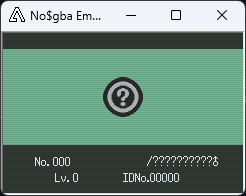
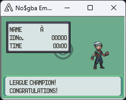
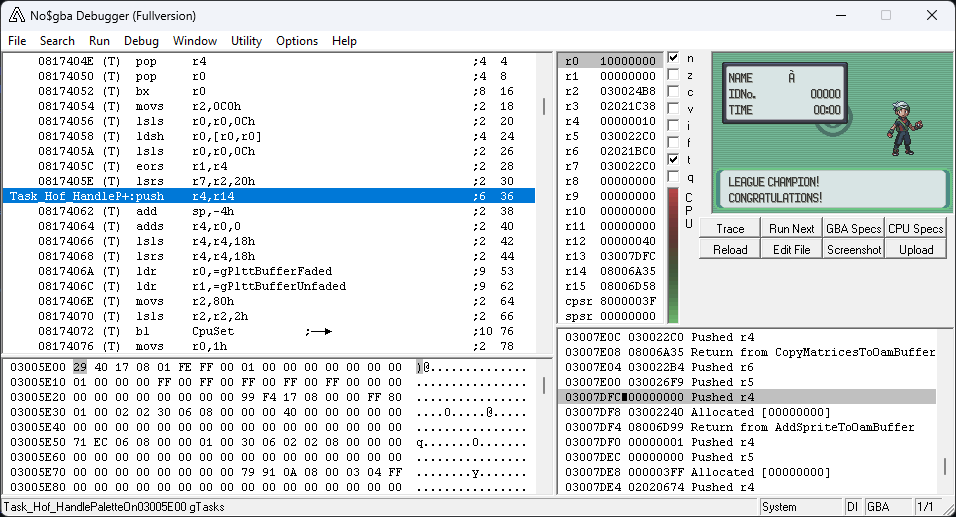
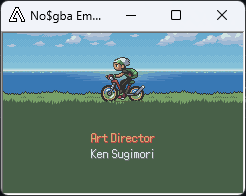
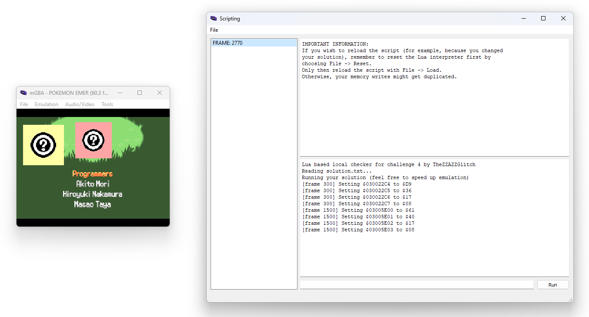

# Hacking Challenge IV - Pokémon Write-What-Where Version (Emerald)

_"I love playing Pokémon Emerald! The buttons on my GBA are really worn off, and they don't work anymore... but who needs buttons when I have a debugger and a steady hand? As long as you tell me which memory addresses I need to modify on which frames, I should be good to go!_

_To complete this challenge, you will need to provide a solution file, which will contain a list of memory edits necessary to complete a fresh game of Pokémon Emerald from scratch. Completion is defined as viewing the credits. For more information about the file format, challenge premises and solution verification, visit the [Challenge IV: Information](https://fools2024.online/ch4.php) page."_

Here we go for the last challenge in the list! In this challenge, we have to complete an entire game of Pokémon Emerald, but there's a twist: we cannot use any input to do so, and instead we are given the possibility to directly write to the memory.

Here are the constraints we have:
- controller inputs are locked
- we can write any number of RAM addresses to any value, but the address must be between `2000000h` and `3FFFFFFh` ([the IWRAM and EWRAM](http://problemkaputt.de/gbatek.htm#gbamemorymap))
- the game must be completed in at most 9000 frames

The solution we have to give is in the form of a text file, where each line is a list of space-separated values, with:
- the first value being the number of the frame when to do the memory write
- the second value being the memory address to write to
- the remaining values being the values to write to that address

As I had already participated in the 2022 event (shameless self-plug: my write-up is available [here](https://github.com/Kuruyia/zzazz2022)) that was also using Pokémon Emerald, I already had some knowledge about this game, so let us begin!

## How does the game trigger the end credits anyway?

As with the other challenges, I'll be using the decompilation of Pokémon Emerald done by [the pret project](https://github.com/pret/pokeemerald) to assist me in solving this challenge, so huge shout-out to them!

The first thing I tried was simply to search for "hall of fame" in the repository, hoping that I'd find some place to begin with. Well, this was a very good start as it only led to 3 files in the search results, one of them being [`hall_of_fame.h`](https://github.com/pret/pokeemerald/blob/af0165a35d675be2ebb402fbaccf0c49ae9504b2/include/hall_of_fame.h) which contains some functions related to, seemingly, showing the Hall of Fame screen to the player (`CB2_DoHallOfFameScreen` and `CB2_DoHallOfFameScreenDontSaveData`).

Once again, searching the repository for `CB2_DoHallOfFameScreen`, we can see that the only place it is used is in the [`post_battle_event_funcs.c`](https://github.com/pret/pokeemerald/blob/af0165a35d675be2ebb402fbaccf0c49ae9504b2/src/post_battle_event_funcs.c#L84) file, where it is given as an argument to the `SetMainCallback2` function.

Looking for where this function is defined leads us immediately to the [`main.c`](https://github.com/pret/pokeemerald/blob/master/src/main.c#L197) file, where we see that this callback is getting saved to the [`callback2`](https://github.com/pret/pokeemerald/blob/af0165a35d675be2ebb402fbaccf0c49ae9504b2/include/main.h#L11) field of a struct named `Main`.

So, we're off to a great start as it was very quick to find how the game was scheduling the Hall of Fame screen to be displayed.

If we take a look at where this `callback2` field is used, we see that it is being called in [the `CallCallbacks` function](https://github.com/pret/pokeemerald/blob/af0165a35d675be2ebb402fbaccf0c49ae9504b2/src/main.c#L188) of that same `main.c` file, function being called itself as part of [the `UpdateLinkAndCallCallbacks` function](https://github.com/pret/pokeemerald/blob/af0165a35d675be2ebb402fbaccf0c49ae9504b2/src/main.c#L171), which is itself executed in [the main loop](https://github.com/pret/pokeemerald/blob/af0165a35d675be2ebb402fbaccf0c49ae9504b2/src/main.c#L131-L168) of the game (take a look at [the project wiki](https://github.com/pret/pokeemerald/wiki/Overview%E2%88%B6-The-Game-Loop) if you want to know more about that!).

So, let's see if we can trigger the Hall of Fame screen directly from the intro. Taking a look at [the symbols file](https://github.com/pret/pokeemerald/blob/a77153fb92937576ac0e14e3f8dd96c52a3d5aff/pokeemerald.sym), we see that:
- the `gMain` variable is present at address `030022C0h`, and the decompilation tells us that the `callback2` field is at offset `004h` from the beginning of this struct: that means that we have to write the address of the callback to memory address `030022C4h`
- the `CB2_DoHallOfFameScreenDontSaveData` function is present at address `081736D8h`, so this is the value that we'll have to write

You can see that I decided to use the `CB2_DoHallOfFameScreenDontSaveData` callback and not `CB2_DoHallOfFameScreen`, as I figured that it would save some time during my experimentation. In the end, the credits were rolling normally even without any save data present, so I kept using this callback.

Using no$gba (because I really like the debugger it has), let's see what's present at this callback address during the intro sequence:


We can see that there's a value of `0816CC01h`, which really looks like an address of some executable code: it seems to be in the same region as our `CB2_DoHallOfFameScreenDontSaveData` callback, and taking a look at the symbols file, we can see that it is exactly where [the `MainCB2_Intro` function](https://github.com/pret/pokeemerald/blob/af0165a35d675be2ebb402fbaccf0c49ae9504b2/src/intro.c#L1036) is placed in memory, which makes a lot of sense since we are... in the intro.

Actually, when I say that it is exactly where this `MainCB2_Intro` function is placed in memory, I'm lying a bit. If we take a look at the address of `MainCB2_Intro` in the symbols file, we can see that it is `0816CC00h` and not the `0816CC01h` that we currently have.

Why is that? Well, it's because the ARMv4T architecture (the architecture of the Game Boy Advance CPU) actually has two instructions set: one is the 32-bit ARM instruction set, and the other one is the [16-bit Thumb instruction set](https://en.wikipedia.org/wiki/ARM_architecture_family#Thumb).

This Thumb instruction set has been created to increase code density (as each instruction is 2 bytes instead of 4), at the expense of reducing the number of available instructions to the ones that were the most used.

To switch between both instruction sets at runtime, one has to use the `BX` instruction (as [the ARMv5 Architecture Reference Manual](https://developer.arm.com/documentation/ddi0100/i) - that is applicable to the ARMv4T instruction set - tells us in section A6.1.1 "Entering Thumb state"): it is used to branch execution to an address, and if the least significant bit of that address is 1, execution will continue in Thumb mode.

We can confirm that the `MainCB2_Intro` function has been indeed compiled to Thumb instructions by taking a look at its disassembly in the emulator:


We see that the instructions are annotated with "(T)", which means that indeed, those are Thumb instructions.

Let's see if the same assertion is true for our `CB2_DoHallOfFameScreenDontSaveData` callback:


We also see the "(T)" annotations, which means that we have to make sure to set the least significant bit of the address of this function to 1: in other words, we'll have to write `081736D9h` (the address of `CB2_DoHallOfFameScreenDontSaveData`) to `030022C4h` (the address of `gMain.callback2`).

So, let's do this and see what happens!



Bingo! The Hall of Fame screen indeed shows up when we do that. So, challenge complete, right?

Well, not exactly, as we are not yet seeing the credits roll up. And something quite unfortunate happens before they appear:



The game actually gets stuck on this text box, waiting for the player to press the A button to continue... except we cannot press on any button as part of this challenge!

## _Not_ pressing any key to continue

So, looks like we have to dive deeper in how this `CB2_DoHallOfFameScreenDontSaveData` callback operate, let's [open it up](https://github.com/pret/pokeemerald/blob/af0165a35d675be2ebb402fbaccf0c49ae9504b2/src/hall_of_fame.c#L427-L435).

We immediately see that his callback is actually not doing a lot, being only 6 lines of code in total. But, something quite interesting immediately shows up: some function named `CreateTask` is called with a pointer to the `Task_Hof_InitMonData` function.

This was something that I actually already knew from my participation in the 2022 April Fools event: the game engine of the 3rd generation of Pokémon games is actually quite complex, and has [a full Task System](https://github.com/pret/pokeemerald/wiki/Overview%E2%88%B6-The-Task-System) to implement game logic during a given screen.

In a nutshell (read the above link if you want to learn more about it!), the task system is a list of tasks (which are functions) that are executed as part of a call [to the `RunTasks` function](https://github.com/pret/pokeemerald/blob/af0165a35d675be2ebb402fbaccf0c49ae9504b2/src/task.c#L110). In our case, this function is called each frame as part of [the `CB2_HallOfFame` callback](https://github.com/pret/pokeemerald/blob/af0165a35d675be2ebb402fbaccf0c49ae9504b2/src/hall_of_fame.c#L358), which has now replaced the `CB2_DoHallOfFameScreenDontSaveData` callback that we wrote at `gMain.callback2` previously.

The Hall of Fame screen is simply a sequence of tasks that are executed to display each steps of the Hall of Fame animation. Let's take a look at the code to see the order of execution of those tasks:
- [`Task_Hof_InitMonData`](https://github.com/pret/pokeemerald/blob/af0165a35d675be2ebb402fbaccf0c49ae9504b2/src/hall_of_fame.c#L437)
- [`Task_Hof_SetMonDisplayTask`](https://github.com/pret/pokeemerald/blob/af0165a35d675be2ebb402fbaccf0c49ae9504b2/src/hall_of_fame.c#L551)
- [`Task_Hof_DisplayMon`](https://github.com/pret/pokeemerald/blob/af0165a35d675be2ebb402fbaccf0c49ae9504b2/src/hall_of_fame.c#L560)
- [`Task_Hof_PrintMonInfoAfterAnimating`](https://github.com/pret/pokeemerald/blob/af0165a35d675be2ebb402fbaccf0c49ae9504b2/src/hall_of_fame.c#L597)
- [`Task_Hof_TryDisplayAnotherMon`](https://github.com/pret/pokeemerald/blob/af0165a35d675be2ebb402fbaccf0c49ae9504b2/src/hall_of_fame.c#L612)
- [`Task_Hof_PaletteFadeAndPrintWelcomeText`](https://github.com/pret/pokeemerald/blob/af0165a35d675be2ebb402fbaccf0c49ae9504b2/src/hall_of_fame.c#L638): there was only one Pokémon to display in our case, so the previous task went immediately to this one
- [`Task_Hof_DoConfetti`](https://github.com/pret/pokeemerald/blob/af0165a35d675be2ebb402fbaccf0c49ae9504b2/src/hall_of_fame.c#L655) (yippee!)
- [`Task_Hof_WaitToDisplayPlayer`](https://github.com/pret/pokeemerald/blob/af0165a35d675be2ebb402fbaccf0c49ae9504b2/src/hall_of_fame.c#L682)
- [`Task_Hof_DisplayPlayer`](https://github.com/pret/pokeemerald/blob/af0165a35d675be2ebb402fbaccf0c49ae9504b2/src/hall_of_fame.c#L695)
- [`Task_Hof_WaitAndPrintPlayerInfo`](https://github.com/pret/pokeemerald/blob/af0165a35d675be2ebb402fbaccf0c49ae9504b2/src/hall_of_fame.c#L709)
- [`Task_Hof_ExitOnKeyPressed`](https://github.com/pret/pokeemerald/blob/af0165a35d675be2ebb402fbaccf0c49ae9504b2/src/hall_of_fame.c#L730)

Well, that was a lot of tasks, but we now know where our problem is! This `Task_Hof_ExitOnKeyPressed` task is the one responsible for waiting for the player to press the A button, and continue the sequence until the credits.

Thankfully, that task is very simple, as its job is quite literally waiting for the A button press and run another task. This is the line that's interesting to us:

```c
gTasks[taskId].func = Task_Hof_HandlePaletteOnExit;
```

To bypass this task, we see that we'll have to overwrite its address in the `gTasks` array with the address of [the `Task_Hof_HandlePaletteOnExit` task](https://github.com/pret/pokeemerald/blob/af0165a35d675be2ebb402fbaccf0c49ae9504b2/src/hall_of_fame.c#L739). This is very close to what we've already done with the `CB2_DoHallOfFameScreenDontSaveData` callback.

So, taking a look at the symbols file, we can see that:
- the `gTasks` array is located at `03005E00h`
- the `Task_Hof_HandlePaletteOnExit` task is located at `08174060h`

Let's take a look at the disassembly of this task in the emulator:



We see that this task is also made of Thumb instructions (try not to be surprised!), so we'll have to make sure that the least significant bit of its address is set to 1: we'll write `08174061h` to the tasks array.

Speaking of the tasks array, we can take a look at it in the memory viewer of the above screenshot, and we can see that the address of task #0 ([the first element of the `Task` struct](https://github.com/pret/pokeemerald/blob/af0165a35d675be2ebb402fbaccf0c49ae9504b2/include/task.h#L15)) is set to `08174029h`. Taking a look at the symbols file, we can see that indeed, it is the memory location of the `Task_Hof_ExitOnKeyPressed` task, as expected.

So, this time, we'll have to write `08174061h` (the address of `Task_Hof_HandlePaletteOnExit`) to `03005E00h` (the address of `gTasks[0].func`). Let's do this:



Great, the credits are showing up! We have successfully done a 0 button press Pokémon Emerald speedrun any%.

## Writing the solution file

~~So, the last step is to submit our run to [speedrun.com](https://www.speedrun.com/)~~

So, the last step is to write the solution file as expected by the event website. We have, in total, 2 memory writes to do:
- a first one, at address `030022C4h` (the address of `gMain.callback2`), with a value of `081736D9h` (the address of `CB2_DoHallOfFameScreenDontSaveData`)
- a second one, at address `03005E00h` (the address of `gTasks[0].func`), with a value of `08174061h` (the address of `Task_Hof_HandlePaletteOnExit`)

[Here](https://github.com/Kuruyia/zzazz2024/blob/1aac802bc7c8fe4ceee286599336de02571964e3/challenges/solution.txt) is the resulting solution file. The frame numbers `300` and `1500` were chosen quite arbitrarily, just by looking at the screen and determining when it would be the correct to do the memory writes.

TheZZAZZGlitch provided us with a Lua script that can be run inside mGBA to try our solutions locally, so let's do just that:



As expected, the credits are rolling up (nice Pokémon sprites btw). Now is the time to upload the solution file to the event website:


Last challenge complete! It was a quick one, but very nice nonetheless.

As a side note, I'm pretty sure that the first write to memory in my solution is useless as removing it and leaving only the part that overwrites the task #0 does also trigger the credits. I can't verify this tho', as the event website doesn't let you try more solutions after you got the correct one.